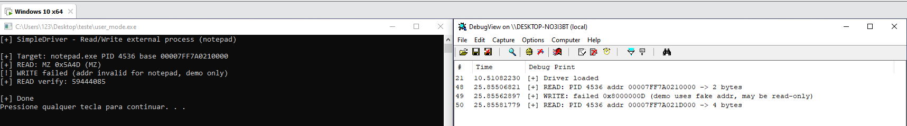

# Windows Kernel IOCTL Demo

Driver-user mode communication and process memory read/write via IOCTL

## How it works

This project demonstrates communication between a WDM kernel driver and a user-mode application using DeviceIoControl (IOCTL). The user-mode app opens the device via `\\.\SimpleDriver`, sends IOCTL codes with buffered data, and the driver processes requests in kernel space.

**IOCTLs**

| Code          | Description                                                                 |
|---------------|-----------------------------------------------------------------------------|
| IOCTL_ADD     | Sends an int, driver adds 1, returns (simple test)                          |
| IOCTL_READ    | Reads memory from a process via MmCopyVirtualMemory                         |
| IOCTL_WRITE   | Writes memory to a process                                                  |
| GET_MODULE    | Returns the base address of a module by walking the target process PEB/LDR  |

## Demo

**Note:** This is a demo. The WRITE uses a hardcoded fake address; it may fail. To use it properly, change the target process and use a valid address.

## Structure

| Folder        | Content                                    |
|---------------|--------------------------------------------|
| `kernel_mode/`| Kernel driver (driver.cpp, headers.h)      |
| `user_mode/`  | User-mode app (main.cpp, headers.h)        |

## Loading the driver

**Option 1** — Test Mode (`sc create` / `sc start`)

**Option 2** — KDMapper or custom loader

MAKE SURE TO ENABLE TEST MODE TO TEST THIS PROJECT. IF YOU WISH TO USE IT OUTSIDE TEST MODE, USE YOUR CUSTOM DRIVER LOADER OR SIGN THE DRIVER.

**NOTE: THIS IS FOR EDUCATIONAL PURPOSES ONLY.**

For more detailed technical analysis and study notes