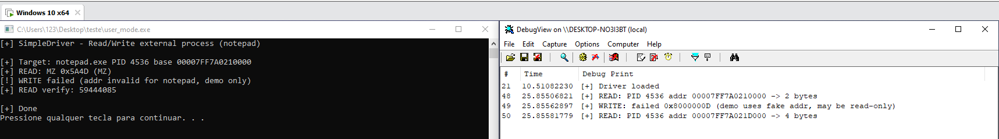

# Windows Kernel IOCTL Demo

Communicate with a Windows kernel driver and read/write process memory through IOCTLs.

## How does it work?

The user-mode app opens `\\.\SimpleDriver` and sends requests through `DeviceIoControl`. The WDM driver handles them in kernel space using buffered I/O.

- `IOCTL_ADD`: adds 1 to an integer.
- `IOCTL_READ` / `IOCTL_WRITE`: read and write process memory.
- `GET_MODULE`: finds a module base address through the target process PEB/LDR.

## Project layout

| Path | Responsibility |
| --- | --- |
| `src/kernel_mode/driver.cpp` | Driver entry, device lifecycle, and IOCTL dispatch. |
| `src/kernel_mode/process.h` / `process.cpp` | Process memory access and module lookup. |
| `src/kernel_mode/native.h` | Native declarations and PEB/LDR structures used by the driver. |
| `src/user_mode/main.cpp` | Demo flow and local process lookup. |
| `src/user_mode/driver_client.h` / `driver_client.cpp` | User-mode calls to `DeviceIoControl`. |
| `src/shared/ioctl.h` | Shared IOCTL codes and packed request structures. |

Headers live beside their implementations. Each Visual Studio project stays with its sources; `kernel_mode.sln` opens both projects from the repository root.

## Build

Use Visual Studio 2022 with the MSVC v143 C++ tools, Windows SDK, and WDK 10.0.26100.0. Open `kernel_mode.sln` and select `Debug | x64`, or run this from a Visual Studio Developer Command Prompt at the repository root:

```bat
msbuild kernel_mode.sln /p:Configuration=Debug /p:Platform=x64
```

Binaries are written to `build/bin/<platform>/<configuration>/<project>/`; intermediate files go to `build/obj/<platform>/<configuration>/<project>/`. These paths also apply when building a `.vcxproj` directly. The `build/` directory is ignored by Git.

The request layout uses pointer-sized fields: build the client for the same architecture as the driver. The module lookup example uses the native 64-bit PEB/LDR layout, not WOW64.

## Demo



The client looks for `notepad.exe`, queries its module base address, and tries to read from a hardcoded address (`0x0000000`). Set a valid address for your own test process before using it.

Enable Windows test mode before loading the driver with `sc create` / `sc start`. Outside test mode, the driver needs signing or a custom loader.

NOTE: THIS IS FOR EDUCATIONAL PURPOSES ONLY. Test in a VM.

This is part of my Windows internals studies. More notes on [my blog](https://cnthigu.github.io/).

## Code style

- Functions use `PascalCase`; variables, parameters, and request fields use `snake_case`.
- Windows APIs, native structure fields, and required entry points keep their original names.
- Allman braces, four-space indentation, and spaces before and inside non-empty function parentheses.
- Comments are short, ASCII-only, and reserved for complex logic.
- `.clang-format` keeps formatting consistent without changing the demo's structure.

Format the code with:

```sh
clang-format -i src/kernel_mode/driver.cpp src/kernel_mode/process.cpp src/kernel_mode/process.h src/kernel_mode/native.h src/user_mode/main.cpp src/user_mode/driver_client.cpp src/user_mode/driver_client.h src/shared/ioctl.h
```
